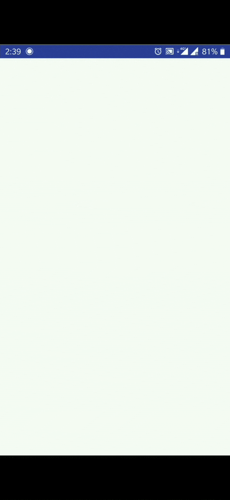

# fallen
A library to detect falls, frequent falls and shakes in Android devices, store data in local database and display notifications. Also a public API
to get all the events from the database, you can get filter list of events as well.

I will support more event gestures in future.

# I am falling app
A sample android app that shows how to use "fallen library" to detect falls and shakes and also frequent falls on an Android device.
Display a list with all the events.

### Implemented by Clean Architecture
The following diagram shows the structure of this project with 3 layers:
- View
- ViewModel
- Model

 

  

 

### Communication between layers

1. UI calls method from ViewModel.
2. ViewModel initiates the sensors using the fallen library.
3. Fallen starts sensing data from the sensors and store events in the local database and displays notifications.
4. Apps gets all the events from the fallen public API.
5. Information flows back to the UI where we display the list of events.

### At a glance:

- Start sensing all fall events.
- Store the duration of events in the local database.
- Return all the events using the exposed public API.
- Display a list of all events with a live paged list.

## How To Use

1. Register the fallen service in your application manifest

       <service android:name="com.example.uzair.fallen.events_service.EventDetectionService" />
    
2. Give the access of the application reference to the fallen library in the Application class
    
       class AppHandler : Application() {
           public lateinit var fallen: Fallen

           override fun onCreate() {
               super.onCreate()

               fallen = Fallen(this)
           }
       }
    
3. Start fallen by 

       fallen = (application as AppHandler).fallen
    
       fallen.startFallen(
        detectFalls = true,
        detectShakes = true,
        detectFrequentFalls = true)
        
 Finally when you are over, stop the service
         
       fallen.stopFallen()
 
 4. You can also give some extra features to fallen like below
  
        fallen.setFallDetectionMessages(resources.getStringArray(R.array.fall_detected_messages))//String array of fall messages
        fallen.setFrequentFallDetectionMessages(resources.getStringArray(R.array.frequent_fall_messages))//String array of frequent fall messages
        fallen.setShakeDetectionMessages(resources.getStringArray(R.array.shake_messages))//String array of shake messages
    
All Done :)

I will be happy to add more updates frequently :)
