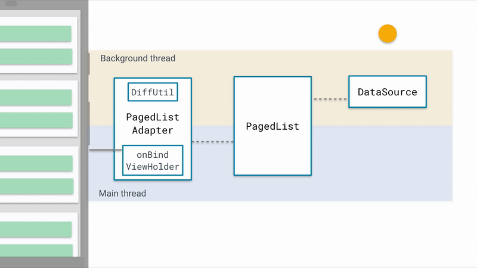

# fallen
A library to detect falls, frequent falls and shakes in Android devices, store data in local database and display notifications. Also a public API
to get all the events from the database, you can get filter list of events as well.

I will support more enevt gestures in future.

# I am falling app
A sample android app that shows how to use fallen to detect falls and shakes and also frequent falls on an Android device.
Display a list with all the events. You can even filter the list with the event type.

### Implemented by Clean Architecture
The following diagram shows the structure of this project with 3 layers:
- View
- ViewModel
- Model

 

  

 

### Communication between layers

1. UI calls method from ViewModel.
2. ViewModel initiates the sensors using the fallen library.
3. Fallen starts sensing data from the sensors and store events in the local database and displays notifications.
3. blaze-downloader saves the images usning LRU caching and spills the images to the adapter to render.
4. Apps gets all the events from the fallen public API.
5. Information flows back to the UI where we display the list of events, with a nice to have filter.

At a glance:

- Start sensing all fall events.
- Store the duration of events in the local database.
- Return all the events using the exposed public API.
- Display a list of all events with a live paged list with a filter to filter events(Shake/Falls).

I will be happy to add more updates frequently :)
